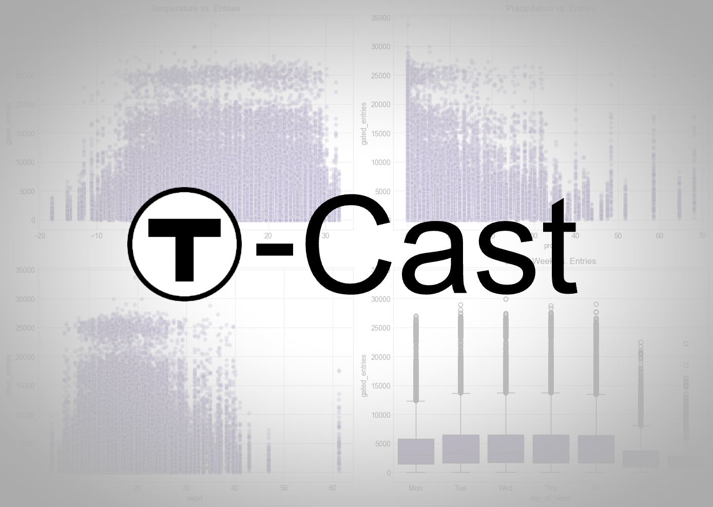
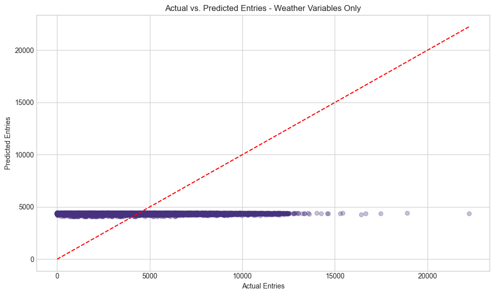
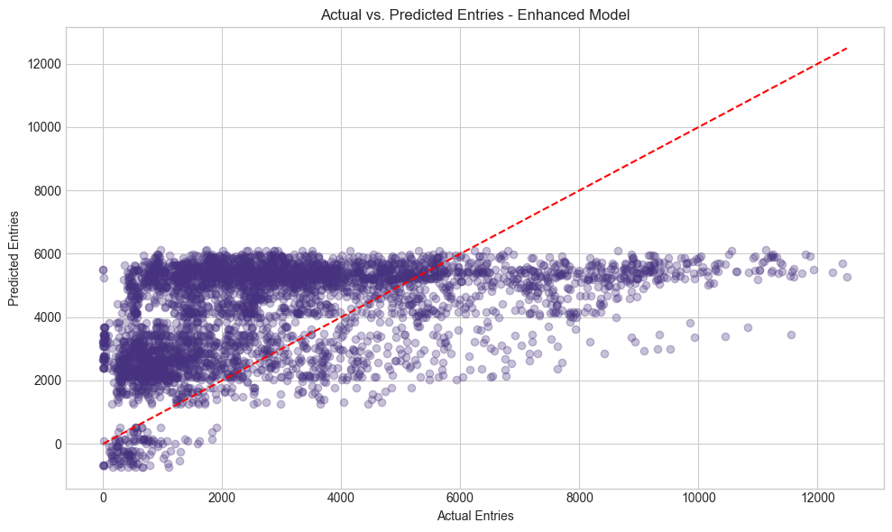
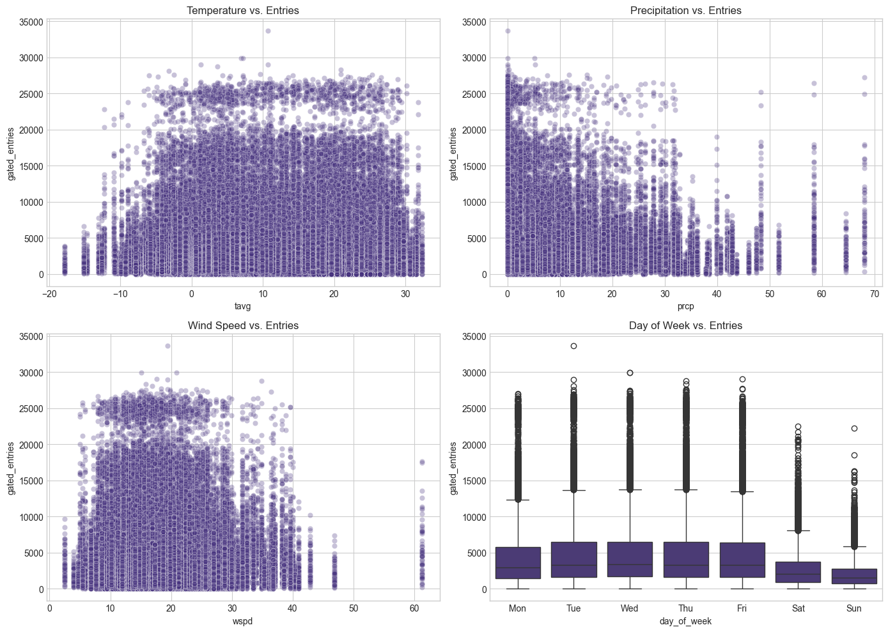
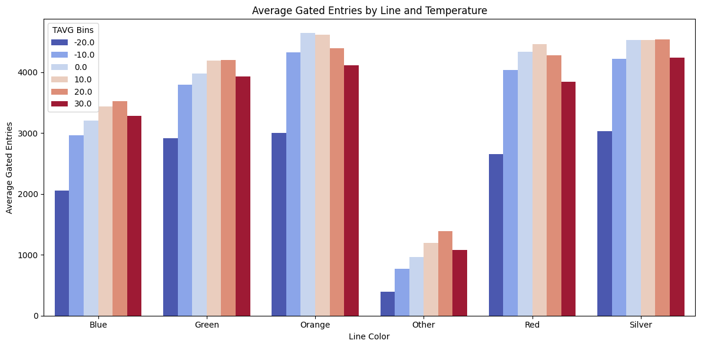
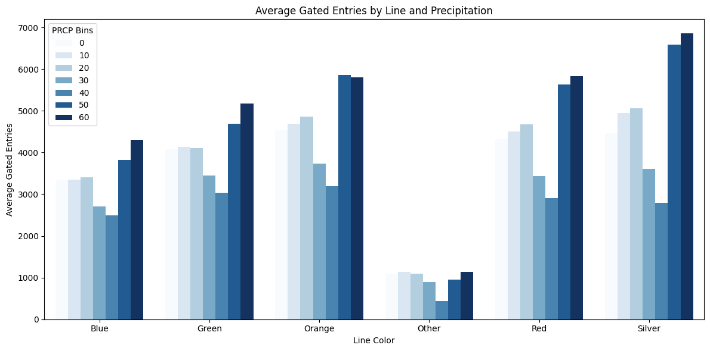
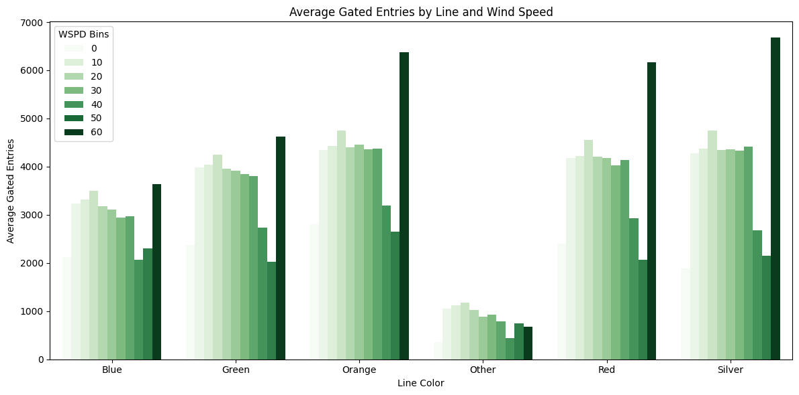

# T-Cast: Predicting MBTA Ridership Based on Weather Conditions

## Project Description

Midterm Report Video: https://youtu.be/1qrfAWM0dHE?feature=shared 

Using historical data publicly available from the MBTA website, our project predicts the number of people that use specific MBTA stations (measured by gate entries) based on weather conditions including temperature, precipitation, and wind speed.

## Goals

The goal of this project is to successfully predict the number of gate entries into MBTA train stations based on weather conditions. This will help MBTA planners understand how weather affects day-to-day ridership to improve operational logistics, such as scheduling train arrivals/departures, staffing, and resource allocation.

## Data Collection

- **MBTA Ridership Data**: Daily gate entries for each MBTA train station from 2018-2023, sourced from MassGIS Data Hub.
- **Weather Data**: Daily weather conditions in Boston from 2018-2023, sourced from Kaggle dataset providing temperature, precipitation, and wind speed measurements.

## Data Processing

Our data processing pipeline includes several key steps:

### Initial Data Consolidation:

- Combined yearly MBTA data files into a single comprehensive dataset
- Processed raw weather data to align with MBTA data format

### Data Cleaning:

- Outlined the null values of the raw MBTA and weather datasets:
  - MBTA: There were many null values for the stop_id column, but since we are looking at gated entries by station, we can ignore it
  - Weather: wdir (wind direction) and pres (average sea-level air pressure): We don't believe these would significantly impact ridership levels
- Removed unnecessary columns (stop_id, route_or_line) from MBTA data
- Dropped wind direction (wdir) and pressure (pres) from weather data
- Handled missing values:
  - For the single missing temperature (tavg) value, imputed using the average of minimum and maximum temperature
  - No missing values were found in the critical columns (gated_entries, precipitation, wind speed)

### Data Transformation:

- Aggregated station entries by date and station name to get daily totals using groupby(['service_date', 'station_name'])
- Standardized date format between datasets using pd.to_datetime
- Added derived features:
  - Day of week (0=Monday to 6=Sunday)
  - Weekend indicator (1 for Saturday/Sunday, 0 otherwise)
  - Month and year variables
  - MBTA line color assignment based on station names

### Data Integration:

- Merged MBTA and weather datasets on service_date using pd.merge with inner join
- Limited dataset to dates where both weather and ridership data were available (Jan 2018 to March 2023)
- Final dataset includes: service_date, station_name, gated_entries, tavg, tmin, tmax, prcp, wspd, day_of_week, is_weekend, month, year, and line_color

## Data Modeling Methods

We implemented a progressive modeling approach to understand the relationship between weather conditions and MBTA ridership:

### Baseline Weather-Only Linear Regression:

- Features: Average temperature (tavg), precipitation (prcp), wind speed (wspd)
- Target: Daily gated entries
- Training Method: Time-based split (train on pre-2022, test on 2022-2023 data)
- Evaluation Metrics: MSE, RMSE, MAE, and R² score
- Results: Weather variables alone provided limited predictive power (negative R² scores for line-specific models)

### Enhanced Linear Regression Model:

- Added temporal features: Day of week, month, and weekend indicator
- Added categorical features: Line color
- Significant improvement in predictive accuracy over baseline model
- Model confirmed that temporal patterns are stronger predictors than weather variables

### Line-Specific Analysis:

- Built separate models for each MBTA line (Red, Green, Orange, Blue, Silver)
- Found varying weather sensitivity across different lines
- Green Line showed highest weather sensitivity, possibly due to its above-ground segments
- Line-specific models revealed unique patterns in how different parts of the system respond to weather

## Key Insights

### Weather Impact Patterns

#### Temperature Effects:

- Generally positive correlation with ridership
- Different impacts across lines (Green Line most sensitive)
- Some recreational-area stations show stronger positive correlation with warm temperatures

#### Precipitation Patterns:

- Non-linear relationship with ridership
- Light to moderate rain (0-30mm) shows minimal impact
- Heavy rain (40mm) leads to decreased ridership
- Extreme precipitation (60mm+) shows ridership increase, suggesting people avoid driving

#### Wind Speed Influence:

- Similar pattern to precipitation
- Mild winds show little effect
- Strong winds (40+ WSPD) decrease ridership
- Extreme winds (60+ WSPD) increase public transit use as alternatives become unsafe

#### Temporal Factors:

- Day of week is the strongest predictor (weekdays vs weekends)
- Weekday patterns show higher, more consistent ridership
- Weekend ridership significantly lower across all stations
- These temporal patterns outweigh weather effects in importance

### Line-Specific Findings

#### Red Line:

- Temperature has a moderate positive effect (3.82 more entries per °F)
- Precipitation shows the expected negative effect
- Wind speed oddly shows a slight positive effect
- Model suggests ridership is moderately affected by weather

#### Green Line:

- Temperature has the strongest positive effect among all lines (12.60 entries per °F)
- Precipitation shows a stronger negative effect compared to other lines
- Wind speed shows the expected negative effect
- Most weather-sensitive line, likely due to above-ground segments

#### Orange Line:

- Temperature shows a counterintuitive negative effect
- Precipitation shows minimal negative effect
- Wind speed shows an unexpected positive effect
- Least weather-sensitive among major lines

#### Silver Line:

- Shows unique and sometimes counterintuitive weather relationships
- Precipitation oddly shows a positive coefficient
- Suggests different ridership patterns than traditional rail lines
  - Possibility due to limited data of the silver line, as it is mostly a shuttle-line

## Test Plan / Metrics

- **Train-Test Split**: Time-based split (train on 2018-2021, test on 2022-2023)
- **Evaluation Metrics**:
  - Root Mean Squared Error (RMSE)
  - Mean Absolute Error (MAE)
  - R² Score
- **Model Comparison**: Enhanced model (with temporal features) significantly outperforms weather-only model

## Next Steps

- Explore more advanced models (Random Forest, XGBoost) to capture non-linear relationships
- Incorporate holiday and special event data
- Develop more sophisticated time-series models
- Create station-specific models for key locations
- Investigate weather-temporal interaction effects (e.g., how precipitation affects weekend vs weekday ridership differently)

## Visualization

### Initial insights

- Both precipitation and wind speed show a non-linear effect on ridership.
- Light to moderate weather has minimal impact, while harsh conditions (40mm+ rain or 40+ WSPD) lead to a drop in ridership.
- During extreme weather (60mm+ rain or 60 WSPD), more people use the T, likely due to unsafe road conditions for cars.
- Temperature also plays a role—stations near recreational areas experience higher ridership in warm weather, likely due to seasonal visits.

### Correlation Between Precipitation, Wind Speed, and Temperature on T Station Entries

By analyzing the graphs of precipitation (prcp bins) and wind speed (WSPD bins) against gated entries at various T stations, a similar trend emerges:

#### 1. Moderate Weather (0-30mm Rain / 0-30 WSPD)

- Ridership remains stable despite light rain or mild winds.
- People continue commuting normally, as these conditions do not significantly impact travel.

#### 2. Heavy Rain (40mm) & Strong Winds (40 WSPD)

- A decrease in entries is observed as commuting becomes less convenient.
- Some people opt for alternative transportation (cars, remote work, delayed travel).

#### 3. Extreme Conditions (60mm Rain / 60 WSPD)

- Unlike the drop at 40mm precipitation, entries rise again at 60mm precipitation and 60 WSPD.
- This suggests that during extreme weather (storm, snowfall, or strong winds), people rely more on public transit, as driving or biking becomes unsafe.

#### 4. Seasonal Temperature Influence

- We can observe a clear curve in gated entries decreasing in certain conditions.
- However, in stations like Aquarium and Revere Beach, entries increase with higher temperatures.
- This suggests a correlation with seasonal travel patterns, where people visit more outdoor or recreational areas during summer.
